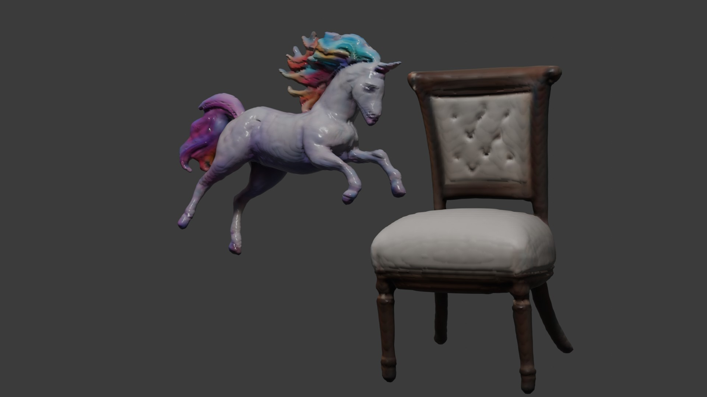

## TransformDepth 🔄

**TransformDepth: Unleashing the Power of Transformers for Depth Estimation**

Dive into the world of depth estimation with the transformative power of state-of-the-art Transformer models. `TransformDepth` offers a streamlined approach to generate depth images from standard 2D pictures, leveraging the latest advancements in AI research.

<p align="center">
  
  
</p>


## Environment Setup

To get started, you'll first need to create a virtual environment and activate it. Ensure you have [Conda](https://docs.conda.io/en/latest/) installed, then run the following commands:

```
conda create -n transform-depth python=3.8
conda activate transform-depth
```
## Installation

To install the necessary dependencies for `TransformDepth`, ensure you have set up and activated your virtual environment as described in the Environment Setup section. Then, you can easily install all required packages by running the following command:

```bash
pip install -r requirements.txt
```

# Load the image
```
image_path = 'transform-depth.jpg'
image = Image.open(image_path)
```
Replace 'transform-depth.jpg' with the path to your image file. For example, if your image is named myphoto.jpg and located in the same directory as the script, you would update the line to:

```
image_path = 'myphoto.jpg'
```
After updating the script with your image path, save the changes. You're now ready to run the depth estimation pipeline and transform your 2D image into a depth map.

## Running the Depth Estimation Pipeline

With the environment prepared and dependencies installed, you're now ready to run the depth estimation pipeline. 
Ensure you have an image ready for processing and execute the following command:

```
python DepthEstimationPipeline.py
```
This will generate a depth image based on your input, showcasing the capabilities of TransformDepth in transforming 2D images into their depth counterparts.

## Run the Python script for batch/single processing images with a specified output directory

```
python DepthEstimationPipeline.py --batch E:\path\to\your\images --output E:\images\batch
```

#### This command runs the DepthEstimationPipeline.py script to process a single image located at ```E:\images\single_image_path\single.png```.

#### It specifies an output directory at ```E:\output_path``` where the processed image will be saved.

```
python DepthEstimationPipeline.py --single E:\images\single.webp --output E:\images --blur_radius 0.3 --median_size 3
```
# command line arguments


```--single```  Path to a single image file to process.

```--batch ```  Path to directory of images to process in batch.

```--output```  Output directory for processed images.

```--blur_radius```  Radius for Gaussian Blur. Default is 4.0. Can accept float values.

```--median_size```  Size for Median Filter. Default is 5. Must be an integer.


#### The Gaussian blur applied has a radius of 0.3, providing slight smoothing to reduce noise without significantly blurring the image details.
#### A median filter of size 3x3 is also applied, which helps further reduce noise and smooth out small artifacts in the image.
#### The command is ideal for refining depth estimations with minimal loss of detail in high-resolution or detailed images.


```
DepthEstimationPipeline.py --single E:\images\single_image_path  --output E:\output_path --blur_radius 0.3 --median_size 3
```

## Citation

[DepthAnything](https://github.com/LiheYoung/Depth-Anything?tab=readme-ov-file)

```
@inproceedings{depthanything,
      title={Depth Anything: Unleashing the Power of Large-Scale Unlabeled Data}, 
      author={Yang, Lihe and Kang, Bingyi and Huang, Zilong and Xu, Xiaogang and Feng, Jiashi and Zhao, Hengshuang},
      booktitle={CVPR},
      year={2024}
}
```
